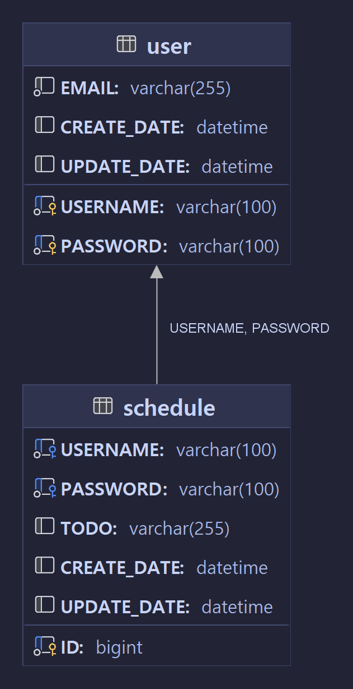

# 일정 관리 앱 만들기

---
## 필수 기능
### Lv1. API 명세서 및 ERD 작성

- #### API 명세서
  - 일정 등록
    - Method = POST
    - URL = /api/schedules
    - Request
      ```json
      {
        "username" : "string",
        "password" : "string",
        "todo" : "string"
      }
      ```
    - Response
      ```json
      {
        "id" : "Long",
        "username" : "string",
        "todo" : "string",
        "create_date" : "string",
        "update_date" : "string"
      }
      ```

  - 일정 목록 조회
    - Method = GET
    - URL = /api/schedules
    - Request
      ```json
      {
        "username(required = false)" : "string",
        "update_date(required = false)" : "string"
      }
      ```
    - Response
      ```json
      [
        {
          "id" : "Long",
          "username" : "string",
          "todo" : "string",
          "create_date" : "string",
          "update_date" : "string"
        },
        {
          ...
        }, ...
      ]
      ```

  - 일정 조회
    - Method = GET
    - URL = /api/schedules/{id}
    - Request
      ```json 
      null
      ```
    - Response
      ```json
      {
        "id" : "Long",
        "username" : "string",
        "todo" : "string",
        "create_date" : "string",
        "update_date" : "string"
      }
      ```

  - 일정 페이지 조회
    - Method = GET
    - URL = /api/schedules/{page}/{size}
    - Request
      ```json 
      null
      ```
    - Response
      ```json
      [
        {
          "id" : "Long",
          "username" : "string",
          "todo" : "string",
          "create_date" : "string",
          "update_date" : "string"
        },
        {
          ...
        }, ...
      ]
      ```

  - 일정 수정
    - Method = PUT
    - URL = /api/schedules
    - Request
      ```json
      {
        "id" : "Long",
        "username" : "string",
        "password" : "string",
        "todo" : "string"
      }
      ```
    - Response
      ```json
      {
        "id" : "Long"
      }
      ```

  - 일정 삭제
    - Method = DELETE
    - URL = /api/schedules
    - Request
      ```json
      {
        "id" : "Long",
        "password" : "string"
      }
      ```
    - Response
      ```json
      {
        "id" : "Long"
      }
      ```

  - 사용자 등록
    - Method = POST
    - URL = /api/users
    - Request
      ```json
      {
        "username" : "string",
        "password" : "string",
        "email" : "string"
      }
      ```
    - Response
      ```json
      {
        "username" : "string",
        "email" : "string",
        "create_date" : "string",
        "update_date" : "string"
      }
      ```

  - 사용자 목록 조회
    - Method = GET
    - URL = /api/users
    - Request
      ```json 
      null
      ```
    - Response
      ```json
      [
        {
          "username" : "string",
          "email" : "string",
          "create_date" : "string",
          "update_date" : "string"
        },
        {
          ...
        }, ...
      ]
      ```

  - 사용자 수정
    - Method = PUT
    - URL = /api/users
    - Request
      ```json
      {
        "username" : "string",
        "password" : "string"
      }
      ```
    - Response
      ```json
      {
        "username" : "string"
      }
      ```

  - 사용자 삭제
    - Method = DELETE
    - URL = /api/users
    - Request
      ```json
      {
        "username" : "string",
        "password" : "string"
      }
      ```
    - Response
      ```json
      {
        "username" : "string"
      }
      ```


- ERD


